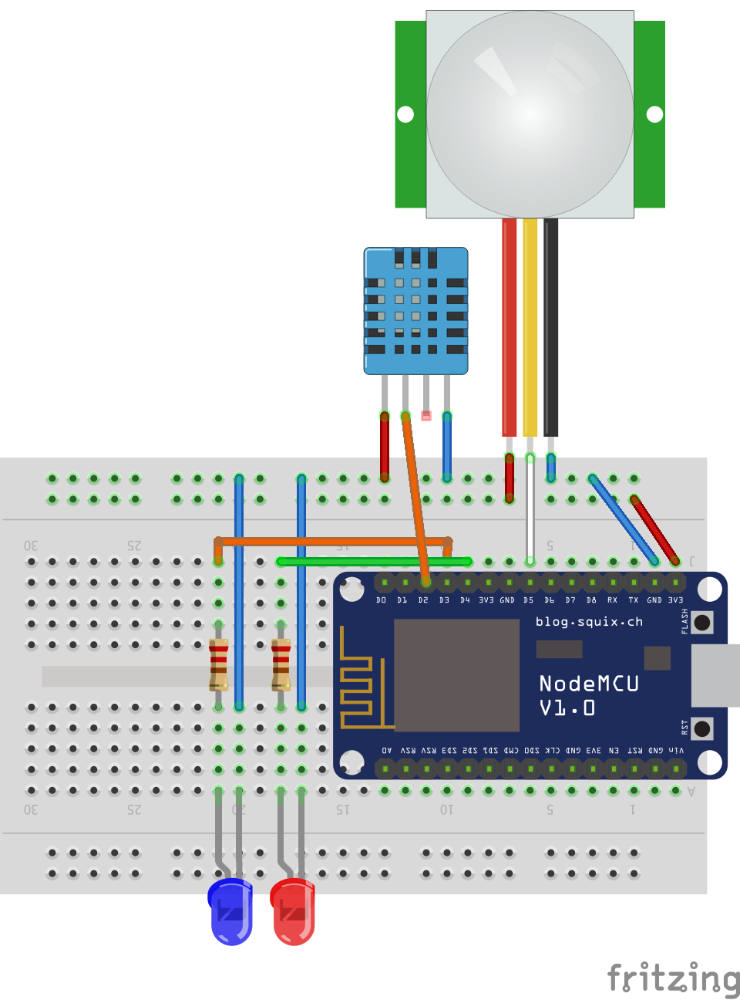

# Home-security-device

<h2>Wiring:<h2>

	

# Binary with firmware:
	nodemcu-master-11-modules-2017-01-15-14-51-22-integer.bin

# Nodemcu modules:
	adc, cjson, dht, file, gpio, mqtt, node, rtctime, sntp, tmr, wifi

# Configuration:
	Before uploading config.json, add the configurations there for wifi, device and mqtt server

# Fritzing sketch:
	sketch.fzz