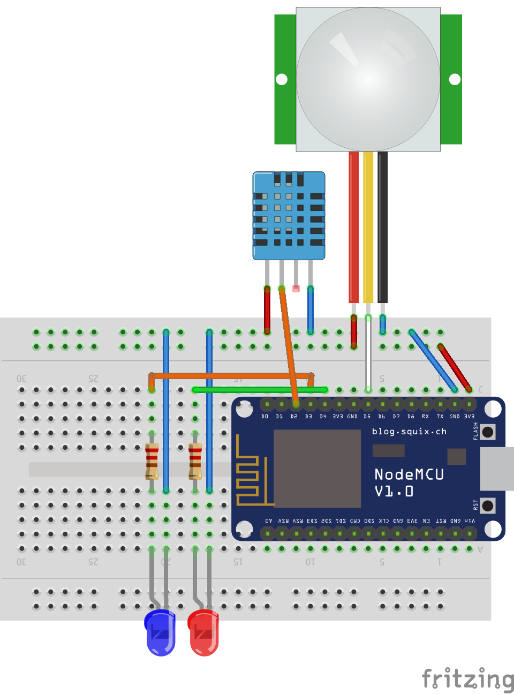

# Home-security-device

<h2>Wiring:<h2>

	

# Building with node.js
	npm install

	npm run build (for uploading all lua source)
	npm run config (for uploading the config.json)
	npm start (for starting the nodemcu terminal)

# Binary with firmware:
	sketch/nodemcu-master-11-modules-2017-01-15-14-51-22-float.bin

# Nodemcu modules:
	adc, cjson, dht, file, gpio, mqtt, node, rtctime, sntp, tmr, wifi

# Configuration:
	Before uploading config.json, add the configurations there for wifi, device and mqtt server

# Fritzing sketch:
	sketch.fzz