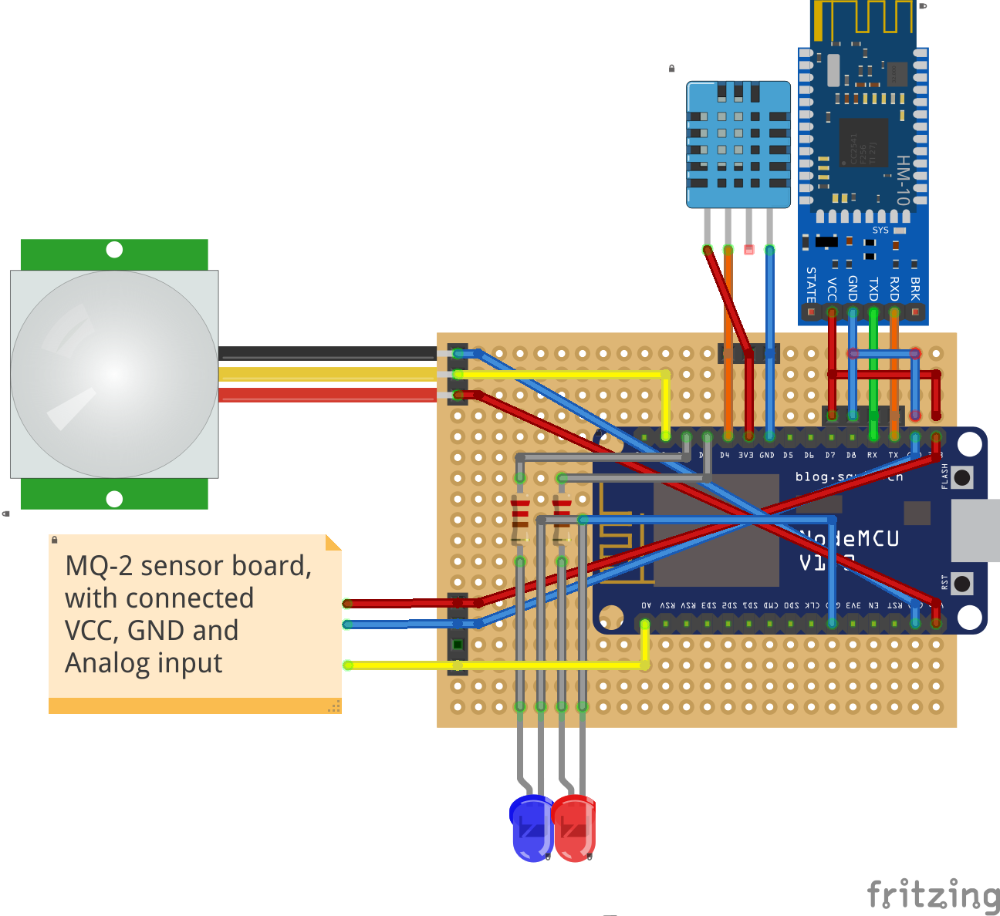

# Home-security-device

<h2>Wiring:<h2>

	

# Binary with firmware:
	firmware/nodemcu-master-13-modules-2017-03-27-14-20-50-float.bin

# Nodemcu modules:
	adc, cjson, crypto, dht, file, gpio, mqtt, node, rtctime, sntp, tmr, wifi, tls

# Configuration:
	Before uploading config.json, add the configurations there for wifi, device and mqtt server

# Fritzing sketch:
	sketch.fzz

Crashes, because old firmware from 23.02.2019 has issues with ssl
new firmware has problems with nodemcu-tool, because changed interface of node.info
